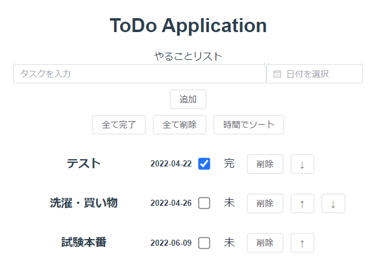

# ToDo-app
Vue.js Node js 練習アプリケーション



## 実行方法
Node.jsをインストールした後，以下コマンドを端末に入力
``` bash
npm install
npm run serve
```

## 参考サイト
- [【初心者向け】Vue3とElementPlusを使ってTodo Listを作ってみた](https://qiita.com/genenao21/items/95b99f452dcce5c7d706)
- [【Vue.js】ref と reactive どっちを使う？](https://zenn.dev/azukiazusa/articles/ref-vs-article)
- [【Vue.js 3.2】`<script setup>` 構文がすごくすごい](https://zenn.dev/azukiazusa/articles/676d88675e4e74)
- [エラー： The template root requires exactly one element](https://qiita.com/takuo_maeda/items/ace84a5d8c360e3bf528)


## 作業時の環境構築
``` bash
# Node.jsインストール後、
npm install -g @vue/cli     # Vue CLIをグローバルにインストール
vue --version               # バージョン確認
vue create todo-app         # プロジェクト作成（vue3.0以降の記述方法
cd ./todo-app               # カレントディレクトリ移動
npm run serve               # 実行
npm install element-plus    # element-plusをインストール
```

##　ビルド時の参考サイト
- [GitHub Pagesにデプロイする](https://qiita.com/e-onm/items/f3ee8679599819084a78)
    - docsフォルダを用いたGitHub Pages公開方法
- [Vue.js初心者がよく間違えるvue/cliの使い方と解決方法の解説](https://iwb.jp/javascript-vuejs-cli-howto/)
    - build出力ディレクトリ変更方法
- [Vue CLI (Vue.js) で failed to load resource ...](https://qiita.com/ymatsuza/items/2348474175fb99e71b32)
    - public pathについて